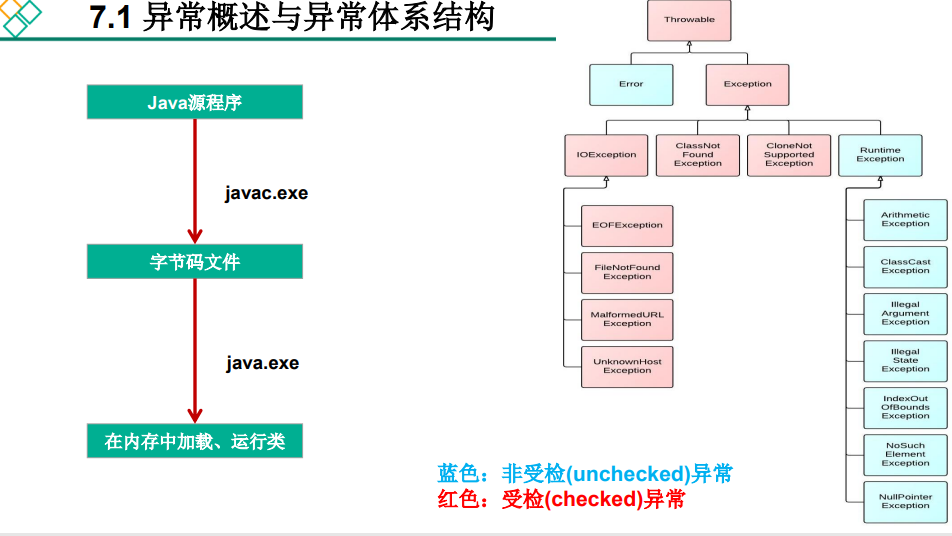

# 一、异常概述与异常体系结构

### 在使用计算机进行项目开发的过程中，即使程序员把代码写的尽善尽美,在系统的运行过程中仍然会遇到一些问题，因为很多问题不是靠代码能够避免的，比如：客户输入数据的格式，读取文件是否存在，网络是否始终保持通畅等等。

- 异常：在Java语言中，将程序执行中发生的不正常情况称为“异常”。（开发过程中的语法错误和逻辑错误不是异常）
- Java程序在执行过程中所发生的异常事件可以分为两类:

> Error：Java虚拟机无法解决的严重问题，如：JVM系统内部错误、资源耗尽等严重错误。比如：StackOverflowError和OOM
> 。一般不编写针对性的代码进行处理。  
> Exception:其他因编程错误或偶然的外在因素导致的一般性问题，可以使用针对性的代码进行处理。例如
>> 空指针访问  
> > 试图读取不存在的文件  
> > 网络连接中断  
> 数组角标越界  

***实际上的异常包括 Error和Exception两种，但是因为Error这个问题一般不会编写针对性代码处理，而是直接修改错误的源代码，所以我们平常说的异常指的是Exception,没有包括Error***

#### Exception

- 对于这些错误，一般有两种解决方法：一是遇到错误就终止程序的运行，另一种方法是由程序员
  在编写程序的时候，就考虑到错误的检测、错误消息的提示，以及错误的处理。
- 捕获错误最理想的是在编译期间，但有的错误只有正在运行时
  才会发生。比如：除数为0、数组下标越界等。
    - 分类：编译时异常和运行时异常

### 具体的划分

#### 从图中可以看到：异常分编译时异常和运行时异常

右图中红色部分为编译时异常（受检异常）、蓝色为运行时异常（非受检异常）

### 常见异常代码

# 二、异常处理机制一：try-catch-finally
在编写程序的时候，经常要可能出现错误的地方加上检查的代码。如进行x/y运算时，要检测分母为0，数据为空，输入的不是数据而是字符等。过多的if-else分支会导致程序的代码加长、臃肿，可读性差。因此采用异常处理机制。
