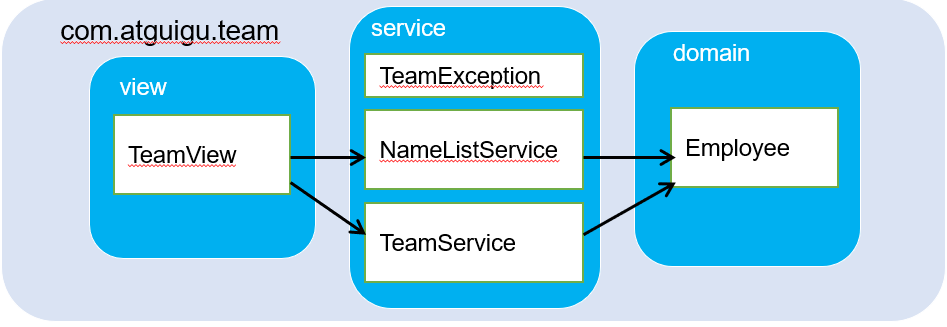

# 目标
* 模拟实现一个基于文本界面的《开发团队调度软件》
* 熟悉Java面向对象的高级特性，进一步掌握编程技巧和调试技巧
* 主要涉及一下知识点：
  * 类的继承和多态性。
  * 对象的值传递、接口。
  * static和final修饰符。
  * 特殊类的使用：包装类、抽象类、内部类。
  * 异常处理。

# 软件设计结构
该软件由一下三个模块组成：

> View 模块为主控模块，负责菜单的显示和处理用户操作。  
> service 模块为实体对象（Employee及其子类如程序员等）的管理模块。  
> domain模块为Employee及其子类等JavaBean类所在的包。

### 内容概述
<ul type="1">
<li>TeamView：查看</li>
<li>TeamException：异常情况</li>
<li>NameListService：显示员工信息</li>
<li>TeamService：开发团队</li>
<li>Employee：顶级类</li>
</ul>
